# MERT Audio Classification Pipeline

This repository provides a complete end-to-end pipeline for **Music Information Retrieval (MIR)** tasks using the **MERT (Music undERstanding model with large-scale self-supervised Training)** foundation model.

It includes scripts for pre-processing raw audio, extracting deep features using a frozen MERT model, training downstream classifiers (currently just Genre Classification supported), and running inference on new audio files.

## 📁 Project Structure

```text
.
├── config.py             # Global configuration (Model ID, Sample Rate, Hyperparameters)
├── preprocess.py         # Step 1: Convert raw audio (MP3/FLAC) to 24kHz WAV
├── extractor.py          # Step 2: Extract features from MERT and save as tensors (.pt)
├── train_gtzan.py        # Step 3: Train a classifier head (e.g., on GTZAN dataset)
├── dataset.py            # Utility: PyTorch Dataset class for loading features
├── model.py              # Utility: Neural Network Head architecture
├── train.py              # Utility: Generic training loop
├── inference.py          # Step 4: Predict genre for new audio files
└── requirements.txt      # Python dependencies

```

##  Quick Start

Follow these steps to go from raw MP3s to a working Genre Classifier.

### 1. Install Dependencies
First, ensure you have **FFmpeg** installed (required for processing MP3s).
* **Ubuntu:** `sudo apt install ffmpeg`
* **Mac:** `brew install ffmpeg`
* **Windows:** [Download FFmpeg](https://ffmpeg.org/download.html) and add to PATH.

Then install the Python requirements:
```bash
pip install torch torchaudio transformers numpy tqdm nnAudio torchcodec
```

### 2. Configuration (config.py)
Check config.py to select your model size.

 * **Default:** m-a-p/MERT-v1-95M (Faster, efficient)
 * **High Performance:** m-a-p/MERT-v1-330M (SOTA results)

 ## 🛠️ Workflow

 ### Step 1: Data Preparation (Pre-preprocess)
 Convert your raw music collection (MP3, FLAC, etc.) into the specific format MERT requires (24kHz Mono WAV).
```bash
# Syntax: python preprocess.py --input <RAW_FOLDER> --output <CLEAN_FOLDER>
python preprocess.py --input "./raw_music/" --output "./preprocessed"
```

 ### Step 2: Feature Extraction
Pass the clean audio through the frozen MERT model. This saves computational time by generating embeddings once and saving them as .pt files.
```bash
# Runs recursively on subfolders in "./raw_data/genres" (or your configured input)
# Output: features_gtzan/ folder containing tensor files.
python extractor.py
```

 ### Step 3: Training (GTZAN Example)
Train a lightweight classification head on top of the extracted features. This script automatically detects class labels from filenames (e.g., rock.001.pt -> Class "Rock").
```bash
# Output: features/trained_genre_head.pth (The trained weights).
python train_gtzan.py
```
 ### Step 4: Inference

Predict the genre of any new song. The script automatically handles resampling, chunking (sliding windows), and aggregation.
```bash
# Copy <song_name>.mp3 into "raw_music" folder
# preprocess all songs to the format in which MERT recognize
python python preprocess.py --input "./raw_music/" --output "./preprocessed"
# Basic Usage (Uses default 10s limit defined in config)
python inference.py ./preprocessed/<song_name>.wav"

# Analyze the first 30 seconds specifically
python inference.py ./preprocessed/<song_name>.wav --limit 30

# Custom windowing (Fine-grained analysis for fast-paced music)
python inference.py ./preprocessed/<song_name>.wav --window 3.0 --overlap 0.5
```

## 📐 Workflow Diagram

```mermaid
graph TD
    %% Nodes
    Raw[🎵 Raw Audio Collection<br/>MP3, FLAC, etc.]
    Pre[Pre-Process Script<br/>preprocess.py]
    Clean[Clean Dataset<br/>24kHz Mono WAV]
    
    MERT[❄️ Frozen MERT Model<br/>Feature Extractor]
    Ext[Extractor Script<br/>extractor.py]
    Feat[Feature Tensors<br/>.pt Files]
    
    Train[Training Script<br/>train_gtzan.py]
    Head[🧠 Trained Head<br/>trained_genre_head.pth]
    
    NewAudio[🎤 New Audio File]
    Infer[Inference Script<br/>inference.py]
    Result([🏷️ Prediction<br/>e.g., 'Jazz'])

    %% Flows
    Raw --> Pre
    Pre --> Clean
    Clean --> Ext
    Ext -- "Loads MERT" --> MERT
    MERT -- "Extracts Embeddings" --> Ext
    Ext --> Feat
    
    Feat --> Train
    Train --> Head
    
    NewAudio --> Infer
    Head -- "Weights Loaded" --> Infer
    MERT -.-> Infer
    Infer --> Result

    %% Styling
    style MERT fill:#e1f5fe,stroke:#01579b,stroke-width:2px
    style Head fill:#fff9c4,stroke:#fbc02d,stroke-width:2px
    style Result fill:#c8e6c9,stroke:#2e7d32,stroke-width:2px

```


##  How It Works

- Input Processing: Audio is resampled to 24kHz.

- Sliding Windows: MERT is optimized for 5-second contexts. We split longer audio into 5s chunks (or use config.MAX_DURATION to limit processing).

- Feature Extraction: The MERT Transformer extracts deep acoustic and musical representations (embeddings).

- Aggregation: A neural network head aggregates these embeddings over time (Average Pooling) to form a single song-level representation.

- Classification: A simple MLP (Multi-Layer Perceptron) maps the representation to specific labels (e.g., Jazz, Rock).

##  Citation
If you use this pipeline or the MERT model, please cite the original paper: Li, Y., et al. (2024). MERT: Acoustic Music Understanding Model with Large-Scale Self-Supervised Training. ICLR.

## Test Data

 Music files used for inference test were taken from [link](https://pixabay.com/music).
